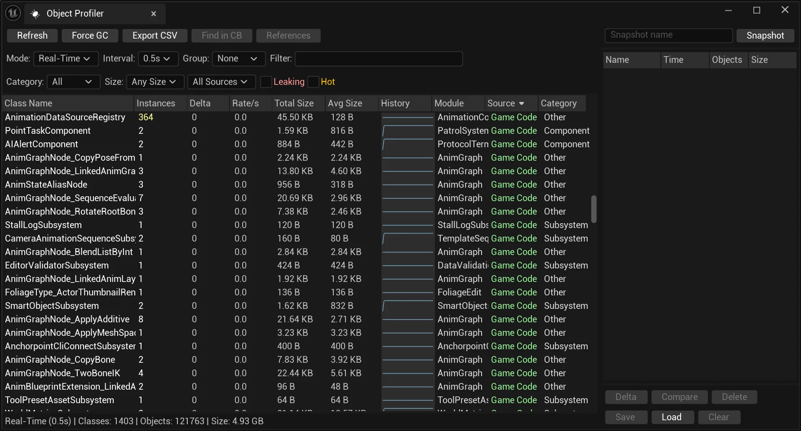

# Object Profiler

A powerful Unreal Engine 5 editor plugin for profiling UObject memory usage, detecting memory leaks, and analyzing object reference graphs in real-time.

## Features

- **Real-Time Monitoring** — Track object creation and destruction with zero-cost incremental tracking using UE's native UObjectArray listeners
- **Leak Detection** — Automatically identifies classes with consistently growing instance counts
- **Hot Object Detection** — Highlights classes with high creation/destruction rates
- **Memory Analysis** — View total and average memory size per class with detailed breakdowns
- **Snapshot System** — Take snapshots and compare object counts over time to identify memory growth
- **Reference Graph** — Visualize incoming and outgoing object references with configurable depth
- **Smart Filtering** — Filter by category, size, source (Engine/Game/Plugin), text search, and leak/hot status
- **Grouping** — Group results by module or category for easier navigation
- **Export** — Export profiling data to CSV for external analysis
- **Content Browser Integration** — Jump directly to assets from the profiler

## Installation

1. Clone or download this repository into your project's `Plugins` folder
2. Regenerate project files
3. Build and launch the editor

Or just download built plugin for your UE version in [releases](https://github.com/PsinaDev/Unreal-Object-Profiler/releases)

## Usage

Open the Object Profiler window via:
- **Window → Object Profiler**
- **Tools → Object Profiler**
- Keyboard shortcut: `Alt+Shift+O`

### Quick Actions

| Shortcut | Action |
|----------|--------|
| `Alt+Shift+O` | Open Object Profiler |
| `Alt+Shift+S` | Take Quick Snapshot |
| `Alt+Shift+G` | Force Garbage Collection |
| `Alt+Shift+R` | Toggle Real-Time Mode |

### View Modes

- **Normal** — Standard view showing current object counts
- **Delta** — Shows changes since last snapshot
- **Real-Time** — Continuous monitoring with configurable update interval (0.5s - 10s)

### Filtering Options

- **Category** — Actors, Components, Assets, Widgets, Textures, Meshes, Materials, Audio, Animation, Blueprints
- **Size** — Filter by memory footprint
- **Source** — Engine Core, Engine Runtime, Engine Editor, Blueprint VM, Game Code, Game Content, Plugin
- **Leaking** — Show only classes with suspected memory leaks
- **Hot** — Show only classes with high activity rates

## Requirements
- Unreal Engine **5.4+**
Built and tested on UE 5.4 - UE 5.6.  
  
## License

MIT License

Copyright (c) 2025 PsinaDev
